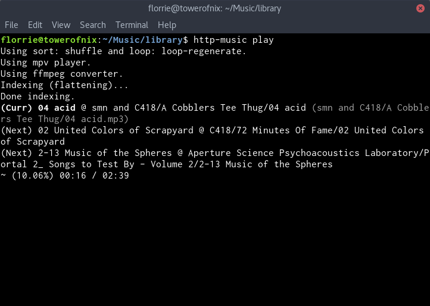
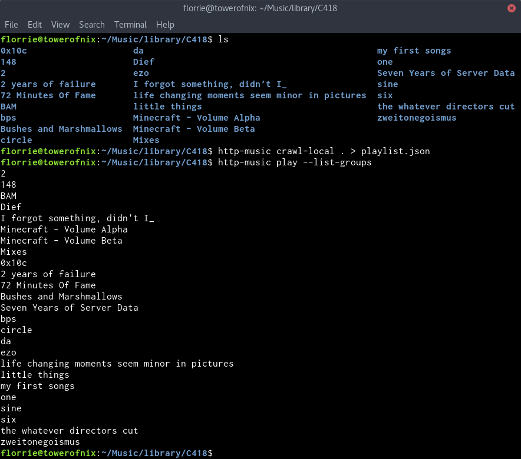
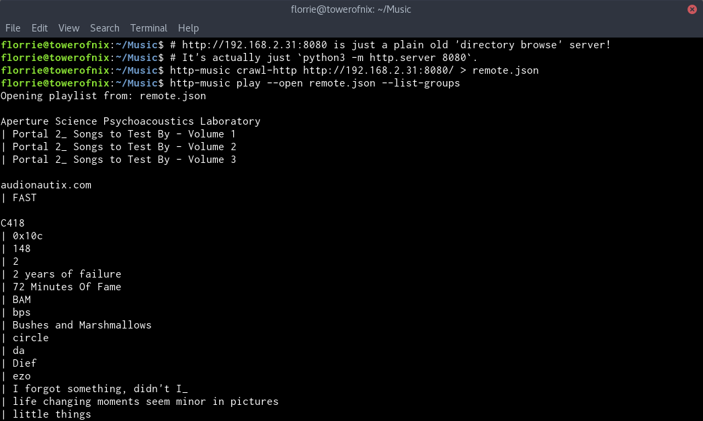
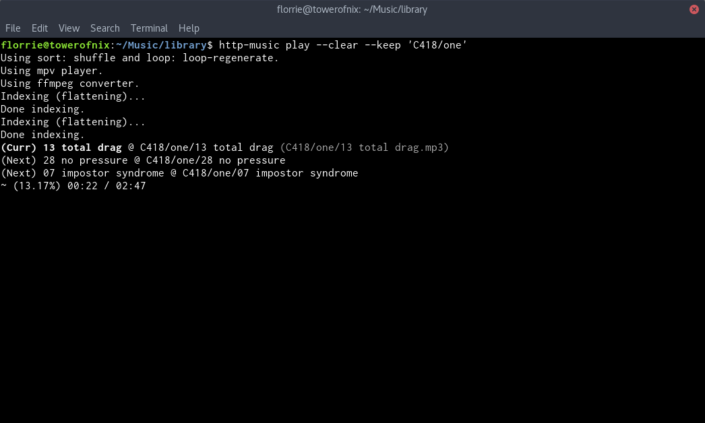

# `http-music`




A command line program that lets you download music from places (like the
internet, or your hard drive) and play it. It's also
[decently powerful](#screenshots).

## Installation

```bash
$ git clone https://github.com/towerofnix/http-music
$ cd http-music
$ npm install

# Installs http-music GLOBALLY, i.e., so you can use from in any directory.
$ npm link # (You might need sudo here.)

# (Hey, you! That one person who only reads the install code! Please also
# read the "you will also need" section below.)
```

**You will also need:**

* **A player:** [`play` (from SoX)][sox] and [`mpv`][mpv] both work. You'll
  only need one of these, but mpv gives you access to play/pause and seeking
  controls.

* **A sound converter:** either [`avconv`][libav] or [`ffmpeg`][ffmpeg] will
  work.

* **Optionally,** [`youtube-dl`][ytdl] lets you [play][apply] music from
  [just about anywhere][moresites] (rather than just
  `http://blah/foo.mp3`-like URLs!).

There's a fair chance you already have some of these installed; you can always
check from your terminal using the [`type`][type] command!

## Usage

```
# Generate a playlist file, using one of these shell commands..
$ http-music crawl-http http://some.directory.listing.server/ > playlist.json
$ http-music crawl-local ~/Music/ > playlist.json

# Then play it:
$ http-music play

# (You can use `python3 -m http.server` or `python2 -m SimpleHTTPServer` to
# run a quick and easy directory listing, to pass into crawl-http!)
```

## Screenshots

**Super-basic usage (`http-music play`):**


**Load music from the file system:**


**Load music from an HTTP server:**



**Filter by a specific group:**



## Documentation

Check out [the man pages](man/). (Or view them with `man http-music`.)

  [sox]: http://sox.sourceforge.net/
  [mpv]: https://mpv.io/
  [libav]: https://www.libav.org/
  [ffmpeg]: https://www.ffmpeg.org/
  [type]: https://unix.stackexchange.com/a/10529/125775
  [ytdl]: http://rg3.github.io/youtube-dl/
  [moresites]: http://rg3.github.io/youtube-dl/supportedsites.html
  [apply]: https://gist.github.com/towerofnix/cd7465a82c8b367eef221e61c3b6186e

